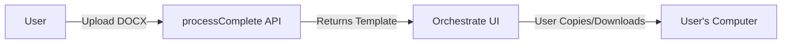
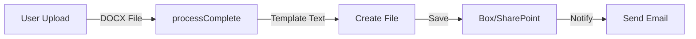
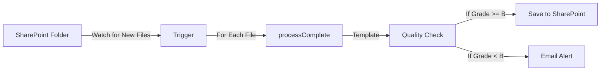
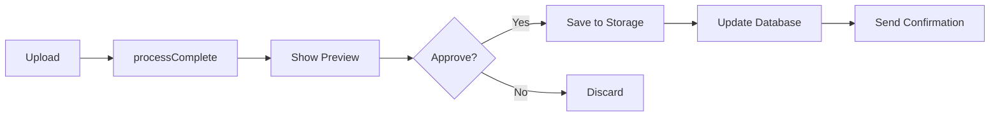
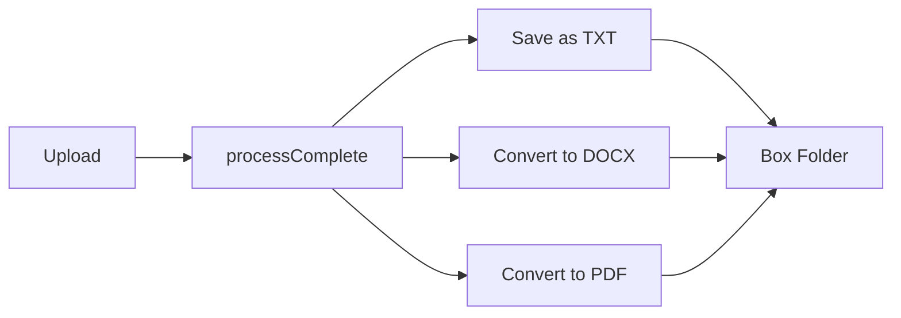
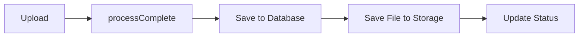

# watsonx Orchestrate Workflow Examples

## How Users Access and Store Outputs

Your API returns **complete data in JSON responses**, which watsonx Orchestrate captures and can use in workflows.

## Understanding the Response

When you call `processComplete`, users receive:

```json
{
  "success": true,
  "message": "Complete processing pipeline executed successfully",
  "generated_template": "# ISO 9001:2015 Quality System Record\n\n[FULL DOCUMENT TEXT HERE - CAN BE THOUSANDS OF LINES]",
  "document_type": "quality_system_record",
  "iso_standard": "ISO 9001:2015",
  "saved_file_path": null
}
```

**Key Points:**
- ✅ **`generated_template`** contains the complete ISO document
- ✅ **Orchestrate captures this entire response**
- ✅ **Users can save, email, or process this data further**
- ℹ️ **`saved_file_path`** is null in production (data is in the response)

## Workflow 1: Simple - Upload and Download

**Use Case:** User uploads a document and gets the ISO template immediately



**Steps:**
1. User uploads document in Orchestrate chat
2. Orchestrate calls `processComplete` skill
3. Response appears in Orchestrate interface
4. User copies template text or downloads as file

**Orchestrate Configuration:**
- Skill: `processComplete`
- Input: File upload
- Output: Display `generated_template` field
- Action: Offer download option

## Workflow 2: Upload → Process → Save to Cloud Storage

**Use Case:** Automatic processing and storage for team access



**Steps:**
1. **Trigger:** User uploads document
2. **Skill 1:** `processComplete` - Generate ISO template
3. **Skill 2:** "Create File in Box" - Save `generated_template` as .txt or .docx
4. **Skill 3:** "Send Email" - Notify team with file link

**Orchestrate Configuration:**
```yaml
Workflow: "Process and Store Document"

Step 1: processComplete
  Input: {{ user_uploaded_file }}
  Output: Save to variable {{ iso_template }}

Step 2: Create File in Box
  Input: 
    content: {{ iso_template.generated_template }}
    filename: "ISO_{{ iso_template.document_type }}_{{ timestamp }}.txt"
    folder: "/Quality/ISO Documents"
  Output: {{ box_file_url }}

Step 3: Send Email
  To: quality@company.com
  Subject: "New ISO Document Generated"
  Body: "ISO template created: {{ box_file_url }}"
```

## Workflow 3: Batch Processing from SharePoint

**Use Case:** Process multiple documents automatically



**Steps:**
1. **Trigger:** New file in SharePoint folder
2. **Skill 1:** `processComplete` - Generate template
3. **Skill 2:** `checkQuality` - Validate quality
4. **Condition:** If quality_grade >= "B"
   - **Yes:** Save to SharePoint approved folder
   - **No:** Email quality team for manual review

**Orchestrate Configuration:**
```yaml
Workflow: "Auto-Process SharePoint Documents"

Trigger: SharePoint - New file in "/Quality/Incoming"

Step 1: Get File Content
  Output: {{ file_content }}

Step 2: processComplete
  Input: {{ file_content }}
  Output: {{ result }}

Step 3: checkQuality
  Input: 
    generated_template: {{ result.generated_template }}
    extracted_fields: {{ result.extracted_fields }}
    document_type: {{ result.document_type }}
    iso_standard: {{ result.iso_standard }}
  Output: {{ quality }}

Step 4: Condition - Check Quality
  If: {{ quality.quality_grade }} in ["A", "B"]
  Then:
    - Create File in SharePoint
      Folder: "/Quality/Approved"
      Content: {{ result.generated_template }}
  Else:
    - Send Email
      To: quality-team@company.com
      Subject: "Document Needs Review"
      Body: "Quality Grade: {{ quality.quality_grade }}\nScore: {{ quality.overall_score }}"
      Attachment: {{ result.generated_template }}
```

## Workflow 4: Interactive Approval Process

**Use Case:** Generate template, get approval, then save



**Steps:**
1. User uploads document
2. Generate template with `processComplete`
3. Show preview to user in Orchestrate
4. **User Decision:**
   - **Approve:** Save to Box and log in database
   - **Reject:** Discard and notify quality team

**Orchestrate Configuration:**
```yaml
Workflow: "Generate with Approval"

Step 1: processComplete
  Input: {{ user_file }}
  Output: {{ template }}

Step 2: Display for Approval
  Show to User: {{ template.generated_template }}
  Ask: "Approve this ISO template?"
  Output: {{ approval_decision }}

Step 3: If Approved
  Condition: {{ approval_decision }} == "Yes"
  Then:
    - Save to Box
    - Log to database (custom skill)
    - Send confirmation email
```

## Workflow 5: Multi-Format Output

**Use Case:** Save template in multiple formats



**Steps:**
1. Generate template
2. Save as plain text (.txt)
3. Convert to Word (.docx) using conversion skill
4. Convert to PDF using conversion skill
5. Store all versions in Box

## Workflow 6: Integration with Database

**Use Case:** Track all processed documents in a system of record



**Steps:**
1. Process document
2. **Custom Skill:** Insert record into database (PostgreSQL/MySQL)
   - Document ID
   - Generated template
   - Quality score
   - Timestamp
   - User ID
3. Save file to cloud storage
4. Update document status

**Custom Database Skill Setup:**
```python
# Custom skill endpoint you can add to your API
@app.post("/api/v1/save-to-database")
async def save_to_database(
    template_id: str,
    generated_template: str,
    document_type: str,
    user_id: str
):
    # Insert into PostgreSQL
    db.execute("""
        INSERT INTO processed_documents 
        (id, template, doc_type, user_id, created_at)
        VALUES ($1, $2, $3, $4, NOW())
    """, template_id, generated_template, document_type, user_id)
    
    return {"success": True, "id": template_id}
```

## Storage Skill Integration

### Built-in Orchestrate Storage Skills

Orchestrate provides native skills for:
- **Box** - Enterprise file storage
- **Dropbox** - Cloud storage
- **Google Drive** - Document storage
- **SharePoint** - Microsoft document management
- **OneDrive** - Personal/business cloud storage

### Using Storage Skills

**Create File Example:**
```yaml
Skill: "Create File in Box"
Inputs:
  - content: {{ api_response.generated_template }}
  - filename: "ISO_Template_{{ timestamp }}.txt"
  - folder_id: "12345" # Your Box folder ID
  - description: "Generated ISO {{ api_response.iso_standard }} template"
```

**Update File Example:**
```yaml
Skill: "Update File in SharePoint"
Inputs:
  - file_id: "existing_file_id"
  - content: {{ api_response.generated_template }}
  - version_comment: "Updated via Orchestrate automation"
```

## Email Integration

**Send Template via Email:**
```yaml
Skill: "Send Email"
Inputs:
  - to: quality@company.com
  - subject: "New ISO Template Generated"
  - body: |
      A new ISO {{ result.iso_standard }} template has been generated:
      
      Document Type: {{ result.document_type }}
      Generated: {{ timestamp }}
      
      Template Content:
      {{ result.generated_template }}
  - attachments: 
      - name: "template.txt"
        content: {{ result.generated_template }}
```

## Best Practices

### ✅ DO:
- **Return complete data in JSON** - Your API already does this!
- **Let Orchestrate handle storage** - Use built-in skills
- **Chain workflows** - Process → Validate → Store
- **Use conditions** - Route based on quality scores
- **Add notifications** - Keep users informed

### ❌ DON'T:
- **Don't rely on file paths** - API files are ephemeral in cloud
- **Don't skip validation** - Use `checkQuality` before saving
- **Don't hardcode values** - Use Orchestrate variables
- **Don't forget error handling** - Add fallback actions

## Testing Your Workflows

### 1. Test Individual Skills
```bash
# Test the API directly first
curl -X POST "https://your-api.up.railway.app/api/v1/process-complete" \
  -F "file=@test.docx" \
  -F "iso_standard=ISO 9001:2015"
```

### 2. Test in Orchestrate Skill Tester
- Go to your skill in Orchestrate
- Click "Test" button
- Upload sample file
- Verify response contains complete template

### 3. Test Full Workflow
- Create simple workflow: Upload → Process → Display
- Test with known document
- Verify output appears correctly
- Add storage skill and verify file is saved

## Monitoring and Logs

### View API Logs
```bash
# Railway logs
railway logs

# Check for errors
railway logs --filter error
```

### Orchestrate Execution History
- Go to Orchestrate dashboard
- Click "Automations" → Your workflow
- View "Execution History"
- Check success/failure rates
- Review input/output for each step

## Need Help?

- **API Issues:** Check `RAILWAY_DEPLOYMENT.md`
- **Orchestrate Setup:** Check `ORCHESTRATE_QUICKSTART.md`
- **Storage Options:** Check `STORAGE_OPTIONS.md`
- **Railway Logs:** `railway logs`

## Summary

**Key Takeaway:** Your API is **already perfect** for watsonx Orchestrate!

✅ Returns complete data in JSON response
✅ Orchestrate captures all fields
✅ Users control where to save outputs
✅ Flexible workflow integration
✅ No database required (but you can add one later)

The `saved_file_path` field is optional - in production it's `null`, and all data is in the JSON response where Orchestrate can access it! 🎉

